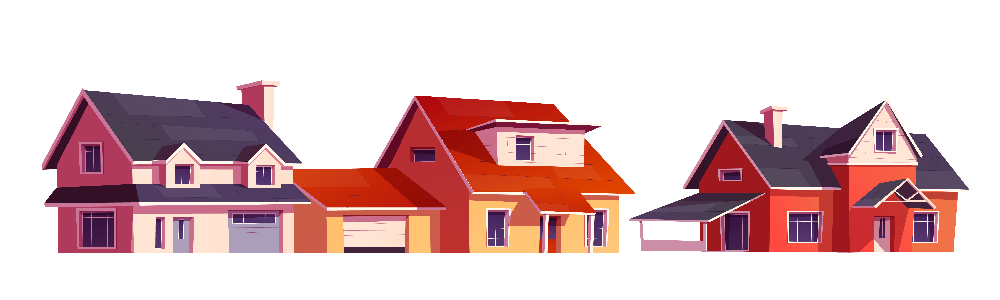

# House-Price-Prediction
Kaggle House Prediction Competition

## General Information
- This project was made in the House Prices - Advanced Regression Techniques hosted in Kaggle
- Advanced regression techniques problems.
- The aim of this project is to predict the sales price for each house.

## Technologies Used
- Python 
- LinearRegression
- GradientBoostingRegressor

## Setup
This project is run in the kaggle environment

## Screenshots

